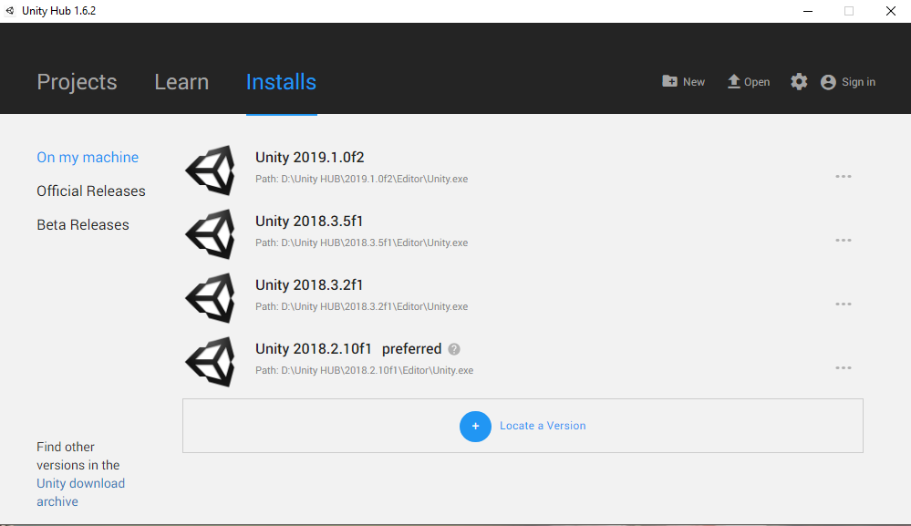
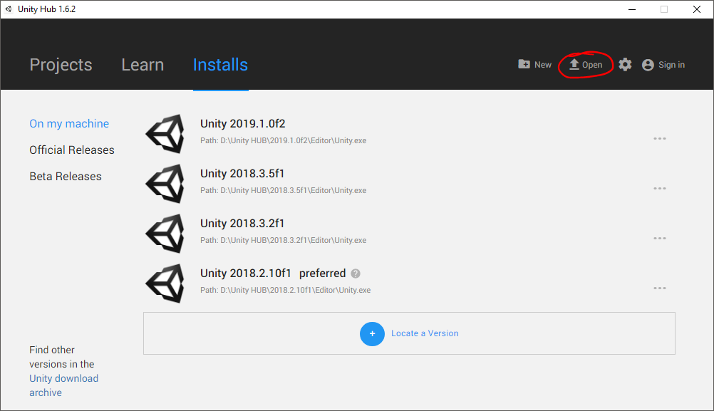
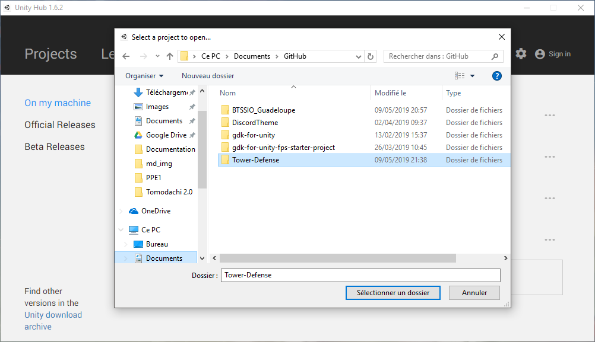

# Digital Défense

## PPE pour examen E4

#### Version Unity : 2018.3.5f1

## comment exporter le projet

Pour récupérer mon Project il vous faudra [UnityHub](https://store.unity.com/fr/download?ref=personal),

## # Installer la version d'unity demander

## # Puis clicker sur Open en haus à doits

## # Et sélectioner le dossier cloner

